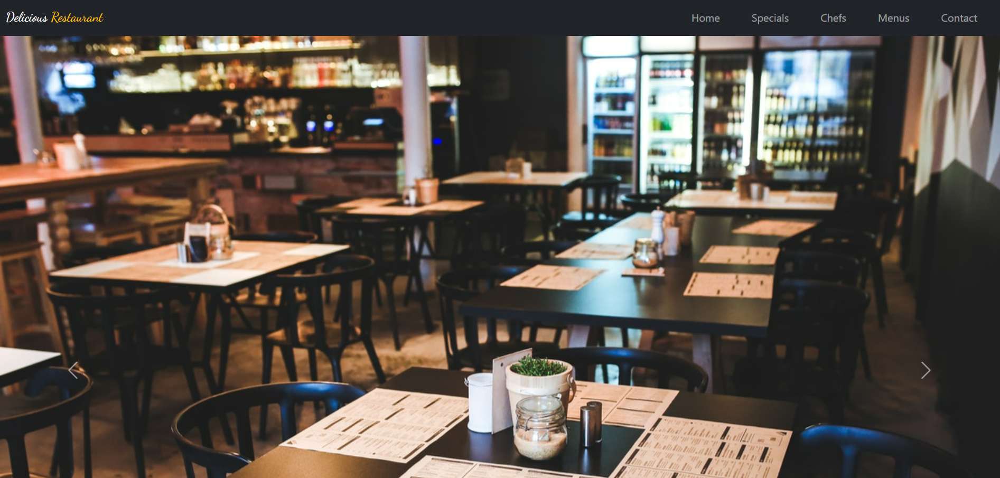
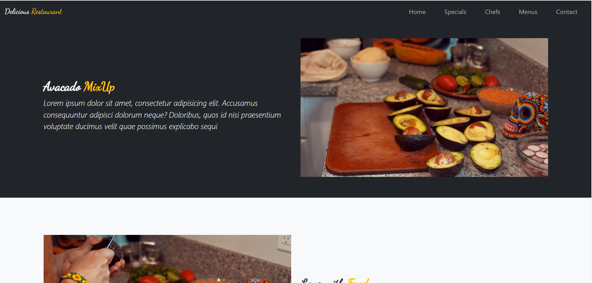
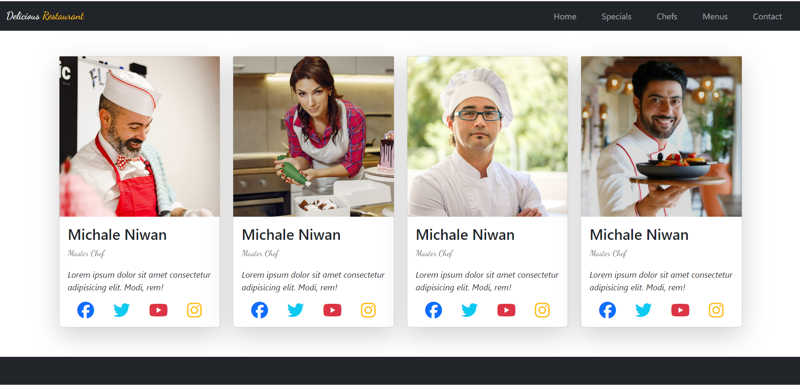
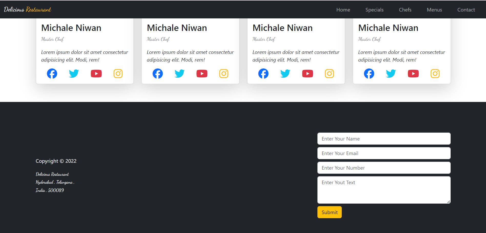

# 🍽️ Restaurant Website

Welcome to the Restaurant Website project! This repository contains the code for a modern and responsive restaurant website built using HTML, CSS, and Bootstrap. The website showcases the restaurant's menu, services, and contact information, providing a great user experience on both desktop and mobile devices.

## 🚀 Demo

[Live Demo](https://sathishkumar-2004.github.io/Restaurant/)

## 🎨 Features

- **Responsive Design**: Adapts to different screen sizes for optimal viewing on any device.
- **Modern UI**: Clean and modern user interface designed with Bootstrap.
- **Menu Display**: Showcases the restaurant's menu items with images, descriptions.
- **Gallery**: Beautiful gallery to highlight the ambiance and dishes.

## 🛠️ Technologies Used

- **HTML5**: Markup language used for structuring the website.
- **CSS3**: Stylesheet language used for designing the website.
- **Bootstrap 5**: CSS framework for building responsive and mobile-first websites.

## 📸 Screenshots


_Home Page_


_Menu Page_


_Cards Page_


_Contact Page_

## 📋 Getting Started

To get a local copy up and running, follow these steps:

### Prerequisites

- A web browser (e.g., Chrome, Firefox, Safari)
- A code editor (e.g., VS Code, Sublime Text)

### Installation

1. **Clone the repo:**

   ```sh
   git clone https://github.com/your-username/restaurant-website.git
   ```

2. **Navigate to the project directory:**

   ```sh
   cd restaurant-website
   ```

3. **Open index.html in your web browser to view the website:**
   ```sh
   open index.html
   ```

## 📧 Contact

Sathish Kumar - sathishkumarvk227@gmail.com

Project Link: https://github.com/SathishKumar-2004/Restaurant.git

## 🌟 Acknowledgements

Bootstrap Documentation
Google Fonts
Font Awesome Icons
Unsplash for free images
